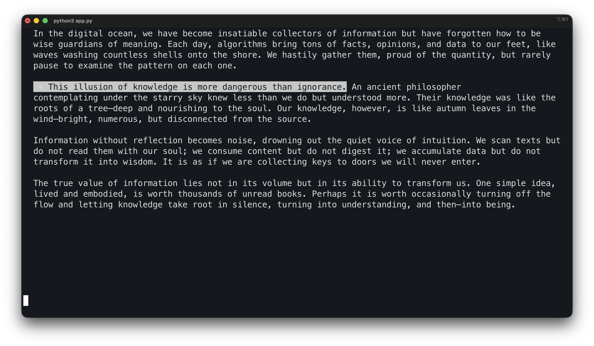

<h1 align="center">FocusThis</h1>
<div align="center">
  
</div>

<p align="center">
  <b>A terminal assistant for rewriting text from the screen</b>
</p>

---

## 📄 About The Project

FocusThis is a simple console application that solves a common problem: when you're rewriting text from a screen onto paper, it's easy to lose your place. The app highlights the current sentence, allowing you to maintain focus and boost productivity.

> **Important:** The project is in **beta** stage. We are actively working on improvements.

### Key Features:
- **🎯 Enhanced Focus**: Never lose the line you're copying again.
- **⚙️ Highly Configurable**: Customize colors and behavior to your liking via a config file.
- **🚀 Lightweight**: Runs right in your terminal, doesn't distract or slow down your system.
- **💻 Cross-Platform**: Should work anywhere Python runs.

---

## 🛠️ Installation & Launch

1.  **Download the project**:
    ```bash
    git clone https://github.com/elkaofficial1/FocusThis
    ```
2.  **Navigate to the project directory**:
    ```bash
    cd FocusThis
    ```
3.  **Build the app**:
    ```bash
    make install
    ```

---

## 🎮 How to Use

1.  Launch the program.
2.  Paste or enter the text you need to rewrite.
3.  Use keys (e.g., `Space` or `Enter`) to navigate between sentences.
4.  The current sentence will be highlighted, helping you keep your place.

### In-App Quick Commands:
- **`q`** - Quit the application.
---

## ⚙️ Configuration

Customize FocusThis to your needs via the `config.yml` file. You can change:
- The highlight color for the current sentence.
- Background and text colors.
- Key bindings for navigation.

---

## 👩‍💻 For Developers

We welcome your pull requests and ideas! If you want to help with the project's development, feel free to contact us.

[](https://t.me/ElkaOfficial1)
[](https://github.com/elkaofficial1)
